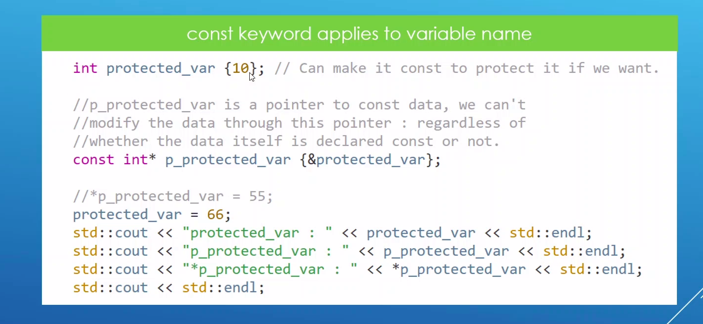

# Content

* Pointer To Const

-----

### It allows us to change the memory location that the pointer is pointing to. But cannot change the value of the varible its pointing to.

**Syntax**

> int number = 20;

> const int* ptr = &number; 

> *ptr = 443; // compile error 

> int number2 = 40;

